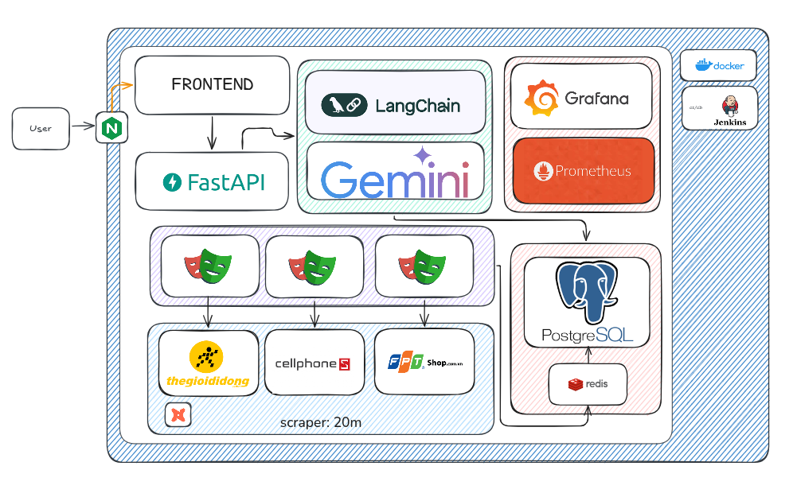
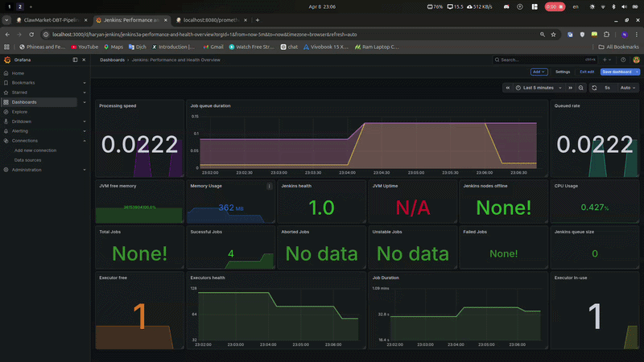

# 🏠 ClawSense AI: Real-time FinHouse Price Intelligence


> **Project:** Hệ thống phân tích thị trường bất động sản thông minh tích hợp AI Agent và quy trình ELT tự động.
> **Key Feature:** Chuyển đổi ngôn ngữ tự nhiên thành SQL (Text-to-SQL) và tự động hóa biến đổi dữ liệu với dbt thông qua Jenkins Pipeline.

---

## 📋 Table of Contents

- [Repository Structure](#-repository-structure)
- [High-level System Architecture](#-high-level-system-architecture)
- [Prerequisites](#-prerequisites)
- [Installation & Setup](#-installation--setup)
- [Running the Application](#-running-the-application)
- [Monitoring & Observability](#-monitoring--observability)
- [Data Flow Pipeline](#-data-flow-pipeline)
- [Demo Video](#-demo-video)

---

## 📂 Repository Structure

```bash
.
├── backend/
│   ├── main.py              # FastAPI Backend & LangChain Logic (Text-to-SQL)
│   ├── requirements.txt              # FastAPI Backend & LangChain Logic (Text-to-SQL)
│   └── Dockerfile           # Đóng gói môi trường Python & AI
├── database/
│   ├── init.sql             # FastAPI Backend & LangChain Logic (Text-to-SQL)
│   └── dbt_transform/       # Analytics Engineering với dbt
│       ├── models/          # Định nghĩa SQL transformations (Bronze/Silver/Gold)
│       ├── dbt_project.yml  # Cấu hình dự án dbt
│       └── profiles.yml     # Cấu hình kết nối Database cho dbt
├── frontend/
├── Jenkins/
│   └── Dockerfile           # Đóng gói môi trường Python & AI
├── monitor/
│   └── prometheus.yml           # Đóng gói môi trường Python & AI
├── scraper/
│   ├── Dockerfile             # FastAPI Backend & LangChain Logic (Text-to-SQL)
│   ├── package.json             # FastAPI Backend & LangChain Logic (Text-to-SQL)
│   └── src/                        # Analytics Engineering với dbt
├── Jenkinsfile              # Quy trình CI/CD tự động (Build -> Test -> Transform)
├── docker-compose.yaml              # Quy trình CI/CD tự động (Build -> Test -> Transform)
└── README.md

```

### High-level System Architecture



# 🔧 Prerequisites

Because the pipeline runs multiple automation and analytical services (Jenkins, dbt, PostgreSQL, and Monitoring Stack), your system should ideally have:

### 🖥️ Hardware Recommendations

**CPU**: 4+ Cores

**RAM**: 12GB

**Disk**: 20GB free space

### 🛠️ Required Tools

| Tool               | Description                                                                                   | Download / Guide                                                    |
| :----------------- | :-------------------------------------------------------------------------------------------- | :------------------------------------------------------------------ |
| **Docker Desktop** | Essential container runtime for running Jenkins, PostgreSQL, and the Monitoring stack.        | [Download Here](https://www.docker.com/products/docker-desktop/)    |
| **Node.js (LTS)**  | JS runtime environment for executing high-speed data scraping scripts (Puppeteer/Playwright). | [Download Node.js (LTS)](https://nodejs.org/en)                     |
| **Jenkins**        | The "Conductor" orchestrating the entire pipeline, from raw data scraping to dbt execution.   | [Download Jenkins](https://hub.docker.com/r/jenkins/jenkins)        |
| **dbt-core**       | The primary tool for transforming data from Bronze to Gold layers via SQL.                    | [Download dbt-core](https://docs.getdbt.com/docs/local/install-dbt) |
| **PostgreSQL**     | Relational database management system serving as the project's Data Warehouse.                | [Download PostgreSQL](https://www.postgresql.org/download/)         |
| **Python 3.11+**   | Runtime environment for FastAPI (AI Agent) and Natural Language Processing (NLP) libraries.   | [Download Python](https://www.python.org/downloads/)                |

---

### ✅ Verification

Run the following commands in your terminal to verify the installation:

```bash
docker --version         # Should be v20.10+
node -v                  # Verify Node.js (LTS recommended)
npm -v                   # Verify Node Package Manager
python --version         # Ensure Python 3.11+ is active
dbt --version            # Confirm dbt-core and postgres adapter are installed
git --version            # Essential for Jenkins & dbt version control
```

---

## 🕹️ Installation & Setup

```bash
# Clone project
git https://github.com/alloc110/ClawSense.git
cd ClawSense

# Init env
cp .env.example .env
# You must have a gemini key in .env
docker compose up -d


# Jenkins: http://localhost:8080
# Grafana: http://localhost:3000 (Default: admin/admin)
# Prometheus: http://localhost:9090
# Postgres: http://localhost:5433
# FastAPI:  http://localhost:8001

```

---

## 🎮 Running the Application

### 🔐 Phase 1: Configure Secret Credentials

Before the pipeline can talk to your Database or AI services, you must store the "Master Keys" securely.

Navigate to **Jenkins Dashboard** → **Manage Jenkins** → **Credentials**.

Select the (**global**) domain and click **Add Credentials**.

Choose **Secret text** from the dropdown and add the following:

**Secret**: viewer_secret_123 (Your actual DB password).

**ID**: db-password-secret-id (Must exactly match your Jenkinsfile and profiles.yml).

**Description**: PostgreSQL Password for dbt.

**(Optional) Repeat for GEMINI_API_KEY if your AI Agent is integrated into the pipeline.**

These IDs are case-sensitive. If they do not match your code, the pipeline will fail to authenticate with the database.

### 🚀 Phase 2: Create the Pipeline Job

Now, let's create the "brain" of your automation.

**New Item**: Click **New Item** from the left-hand sidebar.

**Naming**: Enter **ClawMarket-Main-Pipeline** and select **Pipeline**. Click **OK**.

**Pipeline Configuration**: Scroll down to the Pipeline section:

**Definition**: Select **Pipeline script from SCM**.

**SCM**: Choose **Git**.

**Repository URL**: Paste your GitHub repository URL (e.g., https://github.com/user/repo.git).

**Branch Specifier**: Ensure it points to _/main or _/dev.

**Script Path**: Type Jenkinsfile (this tells Jenkins to look for the logic in your project root).

### ⚙️ Phase 3: Finalize and Run

Click **Save** at the bottom of the page.

You will be redirected to the Job dashboard.

Click **Build Now** to trigger the first run!

### 2. Monitor Real-time Performance

While the pipeline is running, you can watch the "heartbeat" of your system:

Grafana Dashboard: Open localhost:3000 and view the Jenkins Performance dashboard (ID: 9964) to see build durations and success rates.

Prometheus: Check localhost:9090 to verify that all metrics are being scraped correctly.

### 3. Interact with the AI Agent

Once the Gold Layer is populated, it's time to talk to your data. The AI Agent (FastAPI + Gemini) is ready to answer your questions:

Access Swagger UI: Go to http://localhost:8000/docs.

Ask a Question: Use the /ask endpoint to send a natural language query like:

"Which iPhone 15 Pro Max has the best discount today and is sold by a reputable shop?"

## AI Magic: The agent will perform Text-to-SQL, query your Gold tables, and return a human-like insight.

## 🌊 Data Flow Pipeline

```
┌─────────────────────────────────────────────────────────────────────┐
│                       DATA INGESTION LAYER                          │
├─────────────────────────────────────────────────────────────────────┤
│  GitHub Repo   │ Airflow DAGs  │ PostgreSQL (Raw) │  Web Scrapers   │
│ (Jenkinsfile)  │ (Scheduler)   │  (Bronze Schema) │   (Crawler)     │
└────────┬────────────────┬────────────────┬────────────────┬─────────┘
         │                │                │                │
         ▼                ▼                ▼                ▼
┌────────────────────────────────────────────────────────────────────┐
│                       TRANSFORMATION LAYER                         │
├────────────────────────────────────────────────────────────────────┤
│                    Jenkins CI/CD + dbt Core                        │
│ • stg_products (Deduplication)       • dbt Tests (Quality Gate)    │
│ • stg_price_history (Cleaning)       • Python Venv Management      │
│ • dbt Deps & Docs Generation         • GitHub Webhook Triggers     │
└────────┬────────────────────────────────────────┬──────────────────┘
         │                                        │
         ▼                                        ▼
┌─────────────────────────────┐    ┌────────────────────────────────┐
│   POSTGRESQL (Silver)       │    │      POSTGRESQL (Gold)         │
├─────────────────────────────┤    ├────────────────────────────────┤
│ • dim_products (Normalized) │    │ • mart_best_deals (% Disc)     │
│ • fct_price_history (LAG)   │    │ • mart_shop_reputation         │
│ • price_trend calculations  │    │ • mart_all_time_low (Historical)│
│ • brand & company mapping   │    │ • Analysis Summary Tables      │
│ • category classification   │    │ • Ready for AI Inference       │
└─────────────────────────────┘    └────────────────────────────────┘
         │                                        │
         ▼                                        ▼
┌────────────────────────────────────────────────────────────────────┐
│                        SERVING & AI LAYER                          │
├────────────────────────────────────────────────────────────────────┤
│             FastAPI + LangChain + Google Gemini AI                 │
│ • Text-to-SQL Engine                 • Real-time Price Alerts      │
│ • Market Insight Generation          • Grafana Dashboards (9964)   │
│ • REST API Endpoints                 • Prometheus Monitoring       │
└────────────────────────────────────────────────────────────────────┘
```

---

## 🚢 Demo Video

### Demo dashboard



### Demo airflow


